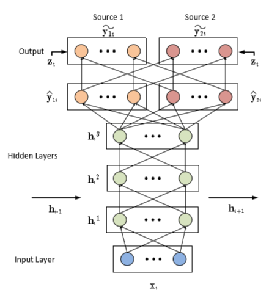

# maCaPeLa - návrh projektu

Cieľom tohto projektu je vytvoriť a natrénovať hlbokú neurónovú sieť, ktorá bude schopná separovať vokály (hlas) od hudby v hudobnom súbore, obsahujúcom oboje.
## Motivácia

Jedným z dôvodov, prečo je separovanie hlasu zaujímavou témou, je tvorba _karaoke_ (hudba bez vokálov), resp. _a cappella_ (iba vokály) verzií hudobných skladieb. Množstvo hudobných skladieb nemá verejne dostupnú karaoke / a cappella verziu a z toho dôvodu vzniká dopyt po nástrojoch, ktoré by takúto verziu dokázali vytvoriť priamo z originálneho hudobného súboru.

Do triedy príbuzných problémov môže pritom patriť tiež problematika "čistenia" zvukových nahrávok od šumu, príp. oddelenie inej zložky zvukového signálu od pôvodnej nahrávky (napr. bicie nástroje). Tieto problémy ponechávame v kontexte realizácie nášho projektu ako otvorené možnosti, pričom sa plánujeme zamerať na už spomínanú problematiku automatizovanej tvorby _karaoke_, resp. _a cappella_ verzií existujúcich nahrávok.

## Existujúce práce

Neurónové siete predstavujú vhodný a zaujímavý nástroj pre účely tvorby modelu, schopného realizovať separáciu vokálov a hudby v rámci hudobnej nahrávky, o čom svedčí tiež existencia viacerých existujúcich publikácií [1,2,3] tohto zamerania. Medzi najvýznamnjšie patrí práca Chandna-eho a kol. [1] v kombinácii s implementovaným softvérom [DeepConvSep](https://github.com/MTG/DeepConvSep), v rámci ktorej autori implementovali niekoľko verzií modelu na báze konvolučných neurónových sietí (CNN) s využitím techniky tzv. časovo-frekvenčného maskovania (z angl. _time-frequency masking_), schopného separovať vybrané zložky zvuku z monoaurálnych nahrávok. Tieto zložky zahŕňajú napr. hlas, basy, bicie a sprievodné nástroje v prípade využitia trénovacieho datasetu [DSD100](https://sigsep.github.io/datasets/dsd100.html), resp. vokály a hudbu v prípade modelu, natrénovanom na datasete [iKala](http://mac.citi.sinica.edu.tw/ikala/). 

V rámci trénovacej fázy autori rozdelili vstupné nahrávky do 20-sekundových segmentov, realizujúc spektrálnu analýzu pomocou STFT (z angl. _Short-time Fourier Transform_) s Hanningovým okienkom veľkosti 1024 vzoriek a vzorkovacou frekvenciou na úrovni 44,1 kHz. Takto predspracované vstupné dáta autori rozdelili na dávky (z angl. _batches_), reprezentujúce modelovaný časový úsek, pričom tieto dáta poslúžili ako vstup pre neurónovú sieť s trénovaním v rámci 30 epoch. Z pohľadu infraštruktúry autori využili aplikačný rámec Lasagne, pričom proces trénovania bol akcelerovaný vďaka využitiu grafickej karty Nvidia GeForce Titan X. 

Na základe vykonanej evaluácie a porovnania výsledkov s architektúrou, postavenou na viacvrstvom perceptróne (MLP), autori konštatujú, že ich riešenie dosahuje veľmi dobré výsledky, pričom dochádza k významnej redukcii času, potrebného na trénovanie modelu. Ako priestor na ďalšie zlepšenie presnosti modelu autori uvádzajú možnosť využitia sekundárnych informácií o vstupných dátach, zahŕňajúcich napr. fundamentálne frekvencie jednotlivých zdrojov (zložiek) zvuku pre separovanie či tzv. _midi_ informácie.

Podobného zamerania je tiež práca Huanga a kol. [2] ([treťostranná implementácia v Tensorflow](https://github.com/andabi/music-source-separation), založená na tejto práci), v rámci ktorej autori implementovali model pre separovanie vokálov od hudby, založený na rekurentných neurónových sieťach (RNN). Podobne ako v prípade práce [1], autori využívajú techniku časovo-frekvenčného maskovania, pričom vstupom pre trénovanie modelu bol dataset [MIR-1K](https://sites.google.com/site/unvoicedsoundseparation/mir-1k) s využitím spektrálnej reprezentácie nahrávok, získanej metódou STFT s obmedzením počtu vzoriek na hodnotu 1024. Optimalizáciu modelu autori realizovali prostredníctvom Broyden-Fletcher-Goldfarb-Shannovho algortimu (L-BFGS) s obmedzením počtu trénovacích epoch na 400. Ilustrácia autormi navrhnutej architektúry poskytuje Obrázok 1 [2].

Obrázok 1: Architektúra rekurentnej neurónovej sieti podľa práce Huanga a kol. [2]

V rámci evaluácie autori konštatujú, že ich model dosahuje porovnateľné výsledky s prácami príbuzného zamerania, pričom ako možnosť jeho ďalšieho využitia (resp. rozšírenia) uvádzajú separovanie hlavnej (dominantnej) melódie z pôvodnej zvukovej nahrávky.
 
Analogickým príkladom môže byť tiež práca Simpsona a kol. [3] ([treťostranná implementácia v Pythone](https://github.com/bachsh/deep-karaoke-maker); [pôvodná v Matlabe](https://github.com/jaidevd/deep_kareoke_source_separation)), ktorá prezentuje model pre separovanie vokálov od hudby, založený na konvolučnej neurónovej sieti, pričom autori sa špecificky zamerali práce na problematiku automatizovanej tvorby karaoke verzií existujúcich piesní.

## Datasety

Pri výbere vhodného datasetu pre trénovanie nášho modelu plánujeme vychádzať z existujúcuch prác [1,2,3], opísaných v predchádzajúcej stati. Jednou z možností je využitie datasetu [MIR-1K](https://sites.google.com/site/unvoicedsoundseparation/mir-1k), ktorý poskytuje celkovo _1000_ nahrávok s celkovou dĺžkou _133 minút_, v rámci ktorých sú vokály a hudobný sprievod atomicky vyčlenené do jednotlivých kanálov (ľavý, pravý), čo nám pskytuje dobrú flexibilitu v kontexte riešenia nami vytýčenej úlohy (separáciu jednotlivých kanálov možno realzovať napr. pomocou programu [Audacity].(https://www.audacityteam.org/). Súčasťou tohto datasetu sú tiež plynulou rečou prečítané texty jednotlivých piesní ich interpretmi či rôzne meta-informácie (anotácie hudobných nahrávok). Veľkosť tohto datasetu činí približne 1,2 GB (formát _wave_).

Vhodnou alternatívou môže byť tiež dataset [DSD100](https://sigsep.github.io/datasets/dsd100.html), obsahujúci celkovo 100 hudobných nahrávok, pričom pre každú z nich je poskytnutá pôvodoná verzia, ako aj súbor s vyčlenenými bicími nástrojmi, basmi, vokálmi a zvyškom hudobného sprievodu. Plná verzia datasetu má celkovú veľkosť približne 14 GB (opätovne formát _wave_).

Za zmienku stojí tiež podobný dataset [iKala](http://mac.citi.sinica.edu.tw/ikala/), ktorý však pre naše účely pravdepodobne využiteľný nebude, nakoľko od roku 2017 nie je verejne dostupný.

Zaujímavou alternatívou môže byť tiež práca so separátnymi nahrávkami hlasu a hudby, ktoré je možné jednoducho zlúčiť, pričom by nemuselo nutne ísť o súvisiace nahrávky. V tomto prípade by bolo zaujímavé zistiť, či model natrénovaný na takýchto dátach dokáže separovať hlas aj z reálnych hudobných skladieb s presnosťou, ktorú možno považovať za akceptovateľnú. 

## Vysokoúrovňový návrh

Celkový postup v kontexte riešenia nami vytýčeného problému možno zachytiť v rámci nasledovných krokov:

#### Získanie a predspracovanie dát

Prvým krokom bude získanie (príp vygenerovanie) dostatočne rozsiahleho datasetu pre trénovanie budúceho modelu, pričom dáta bude potrebné predspracovať do vhodnej podoby, napr. v podobe vytvorenia spektrálnej reprezentácie nahrávok (technika STFT) s obmedzením počtu uvažovaných vzoriek. Dáta budú taktiež rozdelené na trénovaciu a testovaciu množinu, pričom testovacia množina bude neskôr použitá na evaluáciu presnosti modelu. 

Súčaťou tohto kroku môže byť tiež dodatočné čistenie dát od šumu (využijúc exostujúce nástroje) či iná forma redukcie dimenzionality.

#### Návrh a implementácia architektúry

V rámci nasledovného kroku navrhneme a implementujeme vlastnú architektúru neurónovej siete, pravdepodobne postavenú na báze konvolučných neurónových sietí, ktoré v kontexte nami riešeného problému obvykle prinášajú dobré výsledky [1,3].

#### Trénovanie a evaluácia modelu

V tomto kroku dôjde k natrénovaniu implementovaného modelu na trénovacej množine dát, pričom jeho presnosť, resp. výkonnosť bude následne vyhodnotená s využitím vyčlenenej testovacej vzorky dát. Úspešnosť nami vytvoreného modelu následne porovnáme s existujúcimi prácami podobného zamerania.

## Zdroje

[1] CHANDNA, P. et al. Monoaural Audio Source Separation Using Deep Convolutional Neural Networks. In: _International Conference on Latent Variable Analysis and Signal Separation_ [online]. Barcelona: Universitat Pompeu Fabra, 2017. Dostupné na internete: <http://mtg.upf.edu/node/3680>.

[2] HUANG, P. et al. Singing-voice Separation from monaural recordings. In: _International Society for Music Information Retrieval Conference (ISMIR)_ [online]. Illinois: University of Illinois, 2014. Dostupné na internete: <https://posenhuang.github.io/papers/DRNN_ISMIR2014.pdf%0D>.

[3] SIMPSON, A.J.R. et al. Deep Karaoke: Extracting Vocals from Musical Mixtures Using a Convolutional Deep Neural Network. In: _Proceedings of the International Conference on Latent Variable Analysis and Signal Separation (LVA/ICA)_ [online]. 2015. s. 429–436. Dostupné na internete: <https://arxiv.org/ftp/arxiv/papers/1504/1504.04658.pdf>.
